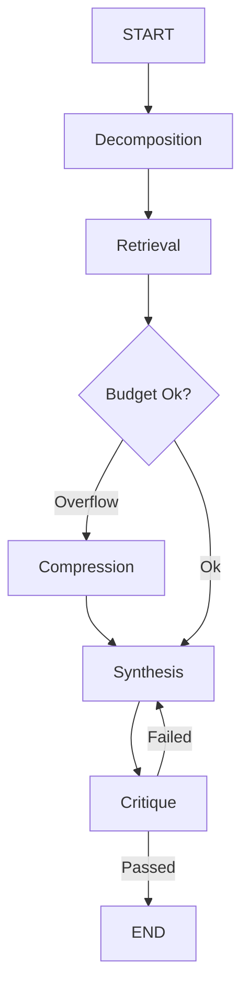
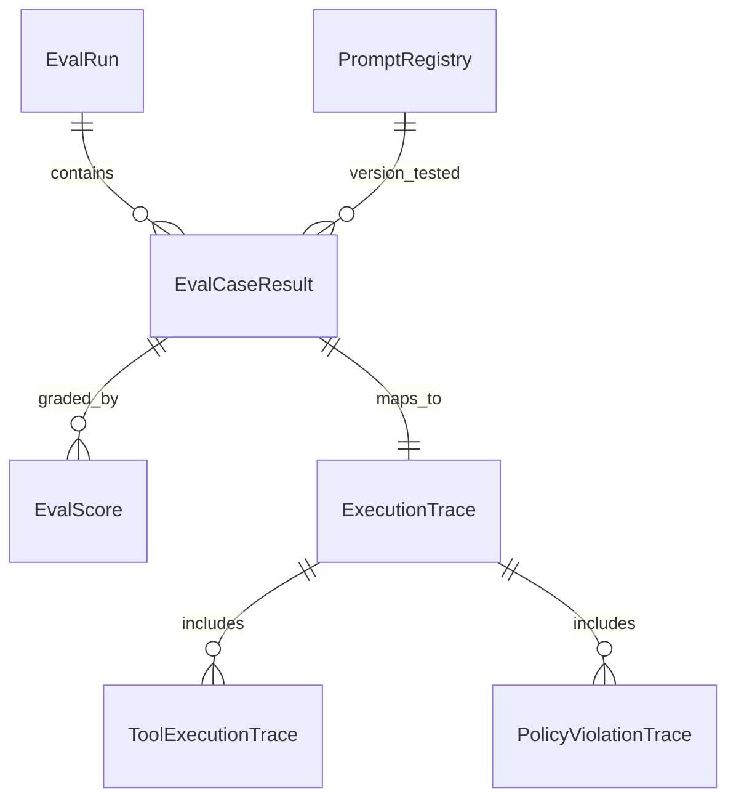
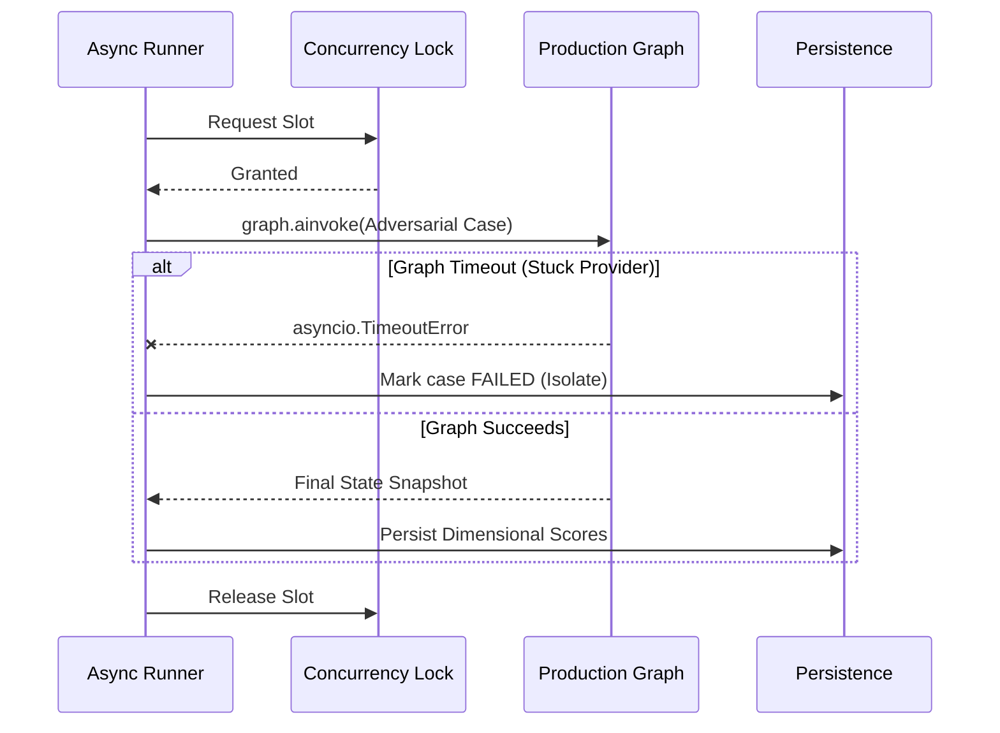
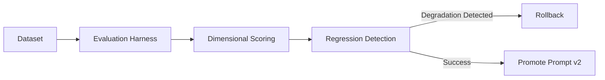

# Observable Multi-Agent Orchestration Framework

This repository provides a production-grade, highly observable, and deterministically evaluable multi-agent orchestration framework built on LangGraph and FastAPI. 

It is designed not simply as an "LLM wrapper", but as a resilient **agent systems platform** with built-in regression tracking, prompt experiment isolation, and strict trace-level provenance.

## 1. System Architecture

The core philosophy of this platform is separating nondeterministic provider intelligence from the deterministic orchestration state machine.

### Execution Lifecycle

The orchestration graph executes sequentially, routing data through targeted intelligent nodes. State mutation is rigorously protected by pure reducer functions, ensuring snapshot-perfect replayability.



### Trace & Thread Linkage

Every node emits strongly-typed execution events. Because the live Server-Sent Events (SSE) queue and the PostgreSQL trace repository both consume from the exact same asynchronous queue injection, the database traces and live UI feedback remain 100% consistent.



---

## 2. Evaluation Architecture

### The "Why" of Evaluation

**Why does the evaluation path equal the production path?**
We do not use a separate "testing pipeline" or mocked graph sequence. The async batch runner invokes `graph.ainvoke(..., config={"configurable": {"thread_id": thread_id}})`. This guarantees that our regression suites hit the exact same timeout boundaries, retry storms, and tool failures that live traffic encounters.

**Why does dimensional scoring exist?**
Scalar scores (e.g., "75/100") destroy analytics quality. We grade across dimensions (`answer_correctness`, `critique_alignment`, `latency`). This allows our regression system to detect if a prompt update improved synthesis logic but dangerously degraded tool efficiency.

**Why adversarial datasets?**
Evaluating happy paths is insufficient. The `datasets/adversarial.py` forces `PROMPT_INJECTION`, `CONTEXT_OVERFLOW`, and `TOOL_TIMEOUT` scenarios to mathematically prove our orchestration boundaries catch and route around failure securely.

### Evaluation Harness Lifecycle



---

## 3. The Prompt Optimization Loop

Prompts are no longer embedded strings inside orchestration code; they are rigorously versioned, schema-enforced assets tracked by a `PromptSpec`. 

**Why decouple prompts?**
By extracting prompt templates, injecting them via `PromptRenderer.render()`, and checksumming their contents, we enable independent lineage tracking and A/B provider testing without altering deployment architectures.



---

## 4. Failure Philosophy

This architecture operates under a strict distributed systems mindset. Nondeterministic LLM providers *will* fail, hallucinate, and hang. Our job is to contain it.

- **Partial Failure Tolerance:** If a tool drops a connection, the `execute_tool_safe` wrapper traps the exception, maps it to a structured `EvalFailureType.TOOL_TIMEOUT`, and yields control back to the orchestrator. The graph does not crash.
- **Isolated Async Cancellation:** During batch evaluation, if a single adversarial case enters an infinite retry loop, the `asyncio.wait_for` wrapper severs the execution context. The runner continues evaluating the remaining 10,000 cases uninterrupted.
- **Reproducibility Guarantees:** Because we enforce `copy.deepcopy` inside LangGraph state reducers, appending immutable `ToolResult` schemas rather than mutating them, any historical thread can be perfectly reconstructed frame-by-frame via `reconstruct_timeline()`.
- **Auditability Guarantees:** Every single `EvalScore` demands a text justification. `EvalFailureType` accepts multiple concurrent composite failure tags per run. You will never guess *why* a pipeline regressed.

---

## 5. Development Setup

```bash
# Initialize Environment
python -m venv venv
source venv/bin/activate
pip install -r requirements.txt

# Run Evaluator Test Suite
python -m pytest tests/test_evals.py

# Run Full Graph Replay
python -m pytest tests/test_graph.py
```
